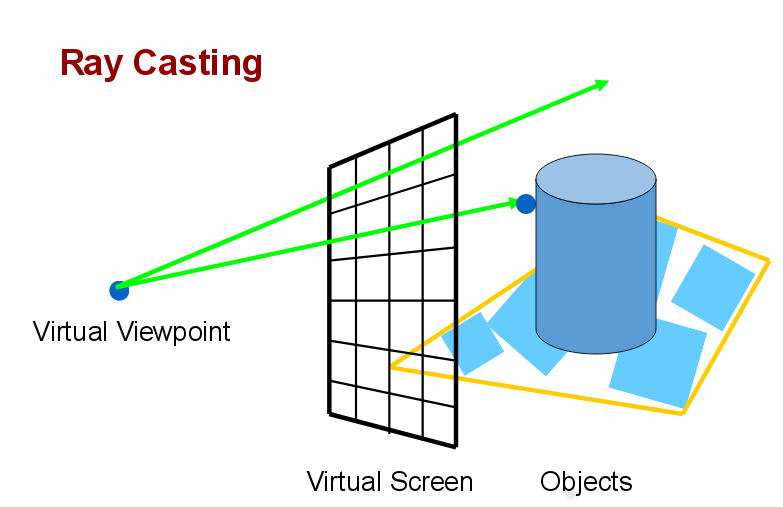

# What is a Raytracer?

Ray tracing is a rendering technique, but you might ask "what is rendering"? In short, Rendering is the process of generating an image from a set of objects, or models, otherwise known as a scene. Ray tracing, is one of many techniques that is used to render photorealistic images. 

Although raytracing has infamously slow render times, it is still a leading technique used in rendering highly realistic images and animations. Pixar's [Renderman](https://www.pixar.com/renderman#renderman-main) results in incredible visual effects, not only can computer scientists agree, the box office shows that audiences agree as well. [Here](https://renderman.pixar.com/products/whats_renderman/movies.html) is a list of movies that used Renderman.   

A raytracer is one such program that employs the raytracing technique to render images. However, there do exist render engines that contain varying rendering techniques, creating a hybrid render engine. See [here](https://hal.inria.fr/IFIP-LNCS-7522/hal-01556165) for an example of a newer such approach. 

One recent, and very impressive example of ray tracing is Unreal Engine's [Star Wars Animation](https://www.youtube.com/watch?v=lMSuGoYcT3s)

## Algorithm Overview 

The raytracing algorithm was invented by Artur Appel in [1968](http://delivery.acm.org/10.1145/1470000/1468082/p37-appel.pdf?ip=137.151.175.96&id=1468082&acc=ACTIVE%20SERVICE&key=F26C2ADAC1542D74%2E5C2875794DF28326%2E4D4702B0C3E38B35%2E4D4702B0C3E38B35&__acm__=1526182103_c99c74dbbea2c692faa129721525a873), and was later termed as the ray casting algorithm. This initial approach created virtual rays of light from an origin to calculate the shade of an object, providing a 3D illusion of a 2D image. Each ray was mathematically cast out into 3D space from the origin, through a virtual viewport. 

The image below can better illustrate this concept, more so than my few words. Because pictures are worth a thousand, and more is better, right?

Simple psuedocode of the ray casting algorithm

		for each pixel in pixels:
			let V be the view ray, V 
			let O be the closest object intersecting with V
			let P be the point where V intersects with O
			let N be the objects normal at P
			let L be the position of the light source
			set pixel to compute_color(P, L, N)

Basic ray casting works, but can be improved, and using this approach as foundation, in [1980](http://delivery.acm.org/10.1145/360000/358882/p343-whitted.pdf?ip=137.151.175.96&id=358882&acc=ACTIVE%20SERVICE&key=F26C2ADAC1542D74%2E5C2875794DF28326%2E4D4702B0C3E38B35%2E4D4702B0C3E38B35&__acm__=1526182248_5c1ff7aa590d10485bb14a79f212a15d), Turner Whitted improved upon Appel's approach and developed ray tracing. Whitted solved a long standing problem in improving shadows, as well as implementaing a method of simulating reflection and transparency. Rather than just calculating a single ray that is cast out into the scene, Whitted recasted multiple rays out from the point of where the ray intersected with an object  The algorithm will be discussed later, for simplicity we well first implement the ray cast algorithm, then extend its functionality.      

[Next](2_ViewRay.md)
