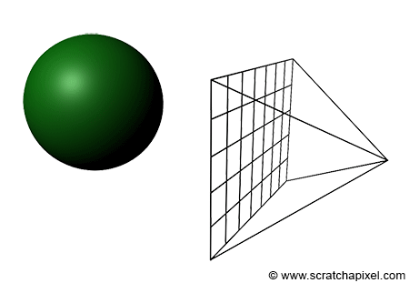
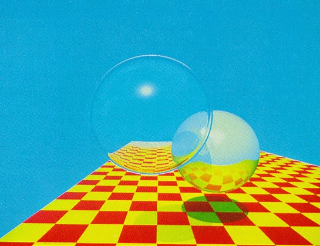

# What is a Raytracer?

Ray tracing is a rendering technique, but you might ask "what is rendering"? In short, Rendering is the process of generating an image from a set of objects, or models, otherwise known as a scene. Ray tracing, is one of many techniques that is used to render photorealistic images. 

Although raytracing has infamously slow render times, it is still a leading technique used in rendering highly realistic images and animations. Pixar's [Renderman](https://www.pixar.com/renderman#renderman-main) results in incredible visual effects, not only can computer scientists agree, the box office shows that audiences agree as well. [Here](https://renderman.pixar.com/products/whats_renderman/movies.html) is a list of movies that used Renderman.   
 
A raytracer is one such program that employs the raytracing technique to render images. However, there do exist render engines that contain varying rendering techniques, creating a hybrid render engine. See [here](https://hal.inria.fr/IFIP-LNCS-7522/hal-01556165) for an example of a newer such approach. 

One recent, and very impressive example of Real-time ray tracing is Unreal Engine's [Star Wars Animation](https://www.youtube.com/watch?v=lMSuGoYcT3s) By real-time, this means that all shade, transformation, animation, and sound effects are being calculated between each frame shown, rather than rendering each frame into a sequence resulting in a video clip. This example shows great promise for ray tracing based algorithms in the future, and supports a claim reportedly said in 1986 that "Ray tracing isn't too slow; computers are too slow". This quote was by Jim Kajiya, who is a greatly influential graphics researcher. Of course, this was said in a time when And according to recent developments in computaion speed, looks like  he may be right.      

## Algorithm Overview 

The raytracing algorithm was invented by Artur Appel in [1968], and was later termed as the ray casting algorithm. This initial approach created virtual rays of light from an origin to calculate the shade of an object, providing a 3D illusion of a 2D image. Each ray is mathematically cast out into 3D space from the origin, through a virtual image. Because our resulting 2D image will have dimensions [0,W)x[0,H), a virtual image is constructed in 3D space, where each pixel in our 2D image corresponds to a point in which our rays will pass through. This virtual image is known as the viewing plane, and exists in 3D world coordinate space as a rectanglular plane perpindicular to the camera's viewing  direction. The image below can better illustrate this concept, more so than my few words. Because pictures are worth a thousand, and more is better, right?

Simple psuedocode of the ray casting algorithm

	func raycast (view_ray):
		for each pixel in pixels:
			let O be the closest object intersecting with view_ray
			let P be the point where V intersects with O
			let N be the objects normal at P
			let L be the position of the light source
			if P is valid:
				set pixel to compute_color(P, L, N)
			else
				set pixel to background_color

Basic ray casting works, but can be improved, and using this approach as foundation, in [1980](http://artis.imag.fr/Members/David.Roger/whitted.pdf), Turner Whitted improved upon Appel's approach and developed ray tracing. Whitted solved a long standing problem in improving shadows, as well as implementaing a method of simulating reflection and transparency. Rather than just calculating a single ray that is cast out into the scene, Whitted recasted multiple rays out from the point of where the ray intersected with an object  The algorithm will be discussed later, for simplicity we well first implement the ray cast algorithm, then extend its functionality. Below is a scan of his famous raytraced image that contains, shadows, reflection, refractions as well as a nice little checker pattered plane. 

To gain some perspective into Kajiya's foresight, and the near improbability that real-time ray tracing could ever be acheived, Whitted's 480x640 image took 74 minutes to render.

A general overview on how to acheive these effects are result in impressive visual effects.
Simple psuedocode of an approach to the ray tracing algorithm, notice this is a rough approach.

	func raycast (view_ray):	
		for each pixel in pixels:
			let V be the view ray, V 
			let O be the closest object intersecting with V
			let P be the point where V intersects with O
			let N be the objects normal at P
			let L be the position of the light source
			let S be the result of compute_shadow_ray(P, L-P, bias)
			if raycast(S) is not background_color:
				return compute_shade_color  
			let color be the result of compute_color(P, L, N)
			if O.is_reflective:
				let R be the result of compute_reflection(view_ray.dir, N)
				let refl_ray contain origin P, and direction R 
				set color to color + O.mix_coeff * raycast(refl_ray)  
			if O.is_refractive:
				let R be the result of compute_refraction(view_ray.dir, N, refr_index)
				let refr_ray contain origin P, and direction R 
				set color to color + (1- O.mix_coeff) * raycast(refr_ray)  
			set pixel to color 

The details of this algorithm will be covered in more detail later, the only detail to notice at this point that the algorithm is recursive! 

[Next](2_GeneratingRays.md)
